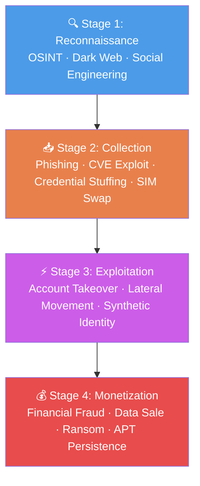
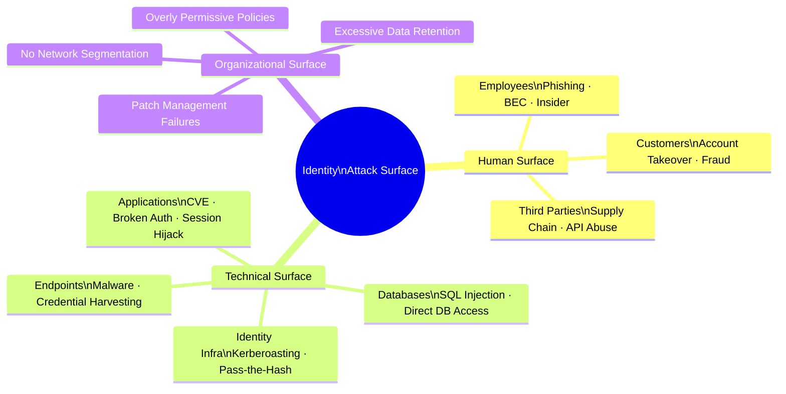

# Identity Theft Lifecycle and Attack Surface Map

---

## The Identity Theft Lifecycle

```
╔════════════════════════════════════════════════════════════════╗
║              IDENTITY THEFT LIFECYCLE                          ║
╚════════════════════════════════════════════════════════════════╝

  ┌──────────────────────────────────────────────────────────┐
  │  STAGE 1: RECONNAISSANCE                                  │
  │                                                           │
  │  Attacker identifies target and collects initial info     │
  │  ├── OSINT: LinkedIn, social media, corporate sites       │
  │  ├── Dark web: leaked credential databases                │
  │  ├── Public data sources: voter records, property data    │
  │  └── Social engineering pre-work: phone calls, emails     │
  └────────────────────────┬─────────────────────────────────┘
                           │
                           ▼
  ┌──────────────────────────────────────────────────────────┐
  │  STAGE 2: COLLECTION                                      │
  │                                                           │
  │  Attacker obtains PII or credentials                      │
  │                                                           │
  │  Technical vectors:                                       │
  │  ├── Phishing / credential harvesting                     │
  │  ├── Vulnerability exploitation → database access         │
  │  ├── Credential stuffing (from prior breach data)         │
  │  └── SIM swapping → account takeover                      │
  │                                                           │
  │  Human vectors:                                           │
  │  ├── Social engineering / pretexting                      │
  │  ├── Insider threat (deliberate or coerced)               │
  │  └── Physical theft (device, document)                    │
  └────────────────────────┬─────────────────────────────────┘
                           │
                           ▼
  ┌──────────────────────────────────────────────────────────┐
  │  STAGE 3: EXPLOITATION                                    │
  │                                                           │
  │  Stolen credentials/PII are used directly                 │
  │  ├── Account takeover (banking, email, benefits)          │
  │  ├── Lateral movement within compromised org network      │
  │  ├── New account fraud (credit applications, loans)       │
  │  └── Synthetic identity construction                      │
  └────────────────────────┬─────────────────────────────────┘
                           │
                           ▼
  ┌──────────────────────────────────────────────────────────┐
  │  STAGE 4: MONETIZATION                                    │
  │                                                           │
  │  Attacker converts access or data into value              │
  │  ├── Financial fraud: wire transfers, card fraud          │
  │  ├── Ransom: threaten to sell or expose data              │
  │  ├── Data sale: sell credentials/PII on dark web          │
  │  └── Long-term access: APT persistence, future use        │
  └──────────────────────────────────────────────────────────┘
```

---

## Attack Surface Map: Where Identity Is Exposed

```
╔═══════════════════════════════════════════════════════════════════╗
║                    IDENTITY ATTACK SURFACE                        ║
╚═══════════════════════════════════════════════════════════════════╝

  ┌─────────────────────────────────────────────────────────────┐
  │  HUMAN SURFACE                                               │
  │                                                              │
  │  ┌──────────────┐  ┌──────────────┐  ┌──────────────────┐  │
  │  │  Employees   │  │  Customers   │  │  Third Parties   │  │
  │  │              │  │              │  │  (vendors,        │  │
  │  │ Phishing     │  │ Phishing     │  │  contractors)    │  │
  │  │ BEC          │  │ Account      │  │                  │  │
  │  │ Insider      │  │ takeover     │  │ Supply chain     │  │
  │  │ threats      │  │ Fraud        │  │ API abuse        │  │
  │  └──────────────┘  └──────────────┘  └──────────────────┘  │
  └─────────────────────────────────────────────────────────────┘

  ┌─────────────────────────────────────────────────────────────┐
  │  TECHNICAL SURFACE                                           │
  │                                                              │
  │  ┌───────────────┐  ┌──────────────┐  ┌──────────────────┐ │
  │  │  Applications │  │  Databases   │  │  Identity Infra  │ │
  │  │               │  │              │  │                  │ │
  │  │ CVE exploits  │  │ SQL injection│  │ AD/LDAP attacks  │ │
  │  │ Broken auth   │  │ Direct DB    │  │ Kerberoasting    │ │
  │  │ API abuse     │  │ access       │  │ Pass-the-hash    │ │
  │  │ Session hijack│  │ Backup theft │  │ Golden ticket    │ │
  │  └───────────────┘  └──────────────┘  └──────────────────┘ │
  │                                                              │
  │  ┌───────────────┐  ┌──────────────┐                        │
  │  │  Endpoints    │  │  Network     │                        │
  │  │               │  │              │                        │
  │  │ Malware       │  │ MitM attacks │                        │
  │  │ Credential    │  │ DNS spoofing │                        │
  │  │ harvesting    │  │ No segmenta- │                        │
  │  │ Physical theft│  │ tion         │                        │
  │  └───────────────┘  └──────────────┘                        │
  └─────────────────────────────────────────────────────────────┘

  ┌─────────────────────────────────────────────────────────────┐
  │  PROCESS / ORGANIZATIONAL SURFACE                            │
  │                                                              │
  │  ├── Insufficient patch management (Equifax)                │
  │  ├── Overly permissive data access policies (Facebook)      │
  │  ├── Weak carrier identity verification (SIM swap)          │
  │  ├── No segmentation between internet & production (T-Mobile)│
  │  └── Excessive data retention beyond operational need       │
  └─────────────────────────────────────────────────────────────┘
```

---

## Defense Mapping: Controls Aligned to Lifecycle Stages

| Lifecycle Stage | Key Threats | Primary Controls |
|---|---|---|
| Reconnaissance | OSINT, dark web monitoring | Limited public exposure; credential monitoring services |
| Collection | Phishing, exploits, credential stuffing | MFA, patch management, anti-phishing controls |
| Exploitation | Account takeover, lateral movement | Network segmentation, least privilege, session monitoring |
| Monetization | Fraud, data sale, persistence | Behavioral analytics, anomaly detection, incident response |

---

## Identity Types and Their Risk Profiles

```
Identity Type     │ Attacker Motivation     │ Detection Difficulty
──────────────────┼─────────────────────────┼──────────────────────
Consumer (PII)    │ Financial fraud, resale │ Low-Medium
Employee creds    │ Network access, BEC     │ Medium
Admin accounts    │ Full system access      │ Medium (high blast radius)
Service accounts  │ Persistent access       │ High (rarely monitored)
Synthetic identity│ Long-term fraud         │ Very high
Child SSNs        │ Long-horizon fraud      │ Extremely high
```

Service accounts and synthetic identities are consistently undermonitored relative to their risk — service accounts because they're often set up and forgotten, synthetic identities because no real victim triggers an alert.

---

*Back to [`README.md`](../README.md)*
